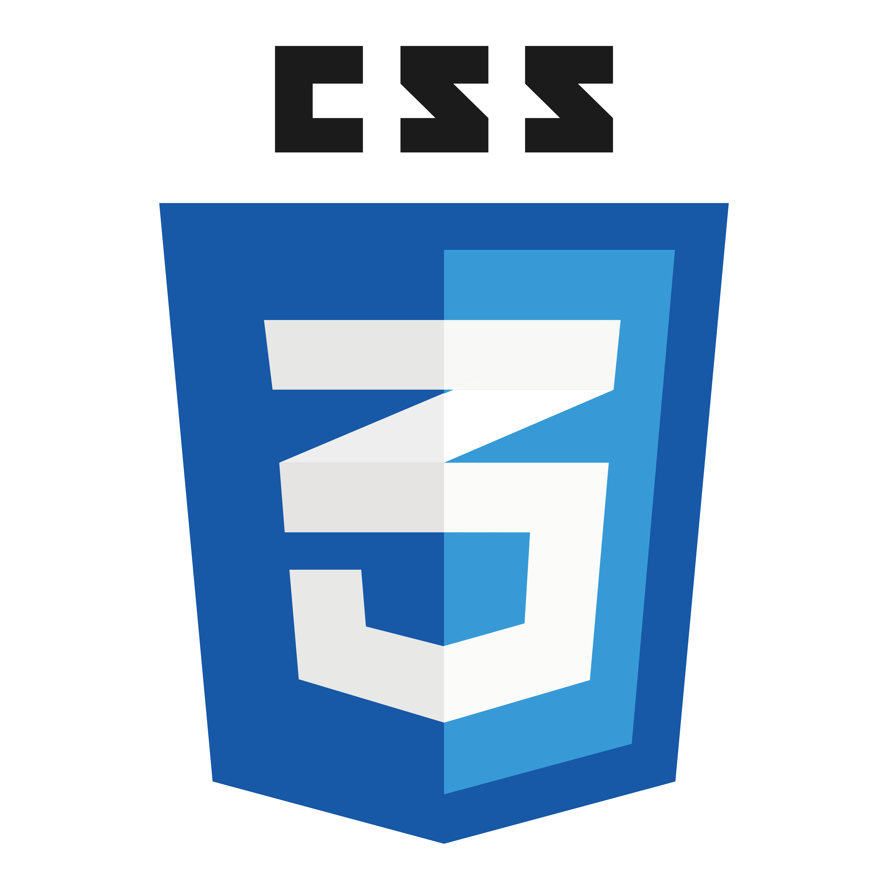

<h3 align="left">ABOUT</h3>

👋 Hi, I’m Lisa from The Netherlands. 
👀 I previously worked as a Technical Product Owner. 
👀 Currently, I work as a data collector. 
🌱 I'm interested in Data Analysis. I'm learning about SQL, PowerBI, Excel, and Python. 
💞️ Feel free to connect on Social Media.  

<h3 align="left">LANGUAGES & TOOLS</h3>

 

 
<h3 align="left">CONNECT</h3>

 
