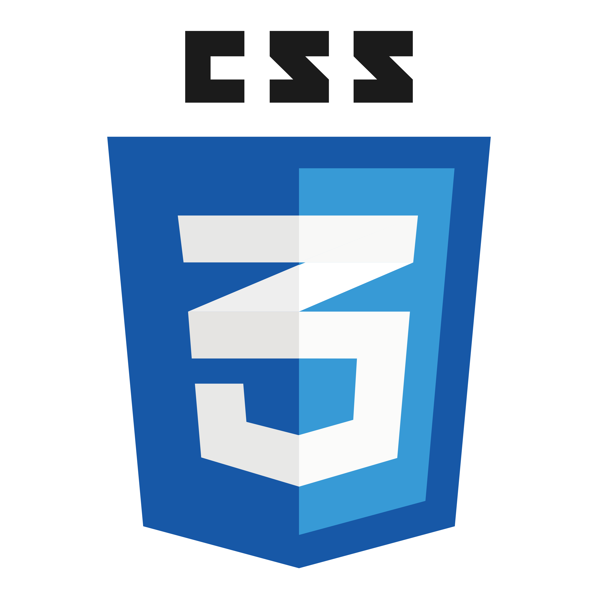

<h3 align="left">ABOUT</h3>

👋 Hi, I’m Lisa from The Netherlands. 
👀 I’m a Front-End Developer interested in Full-Stack Development, App Development, Game development, Blockchain development, Pixel Art. 
🌱 I’m currently learning Git, HTML, CSS and Javascript. 
🌱 Next: React, Node.js, Linux, C++, C#, Java, PHP, SQL, Web3, HackTheBox. 
💞️ I’m looking to connect with Pixel Art Web Devs, Web3 Devs, Pentesters and Social Media Devs. 

<h3 align="left">SKILLS</h3>

 
 

 

 

<h3 align="left">CONNECT</h3>
 

 
